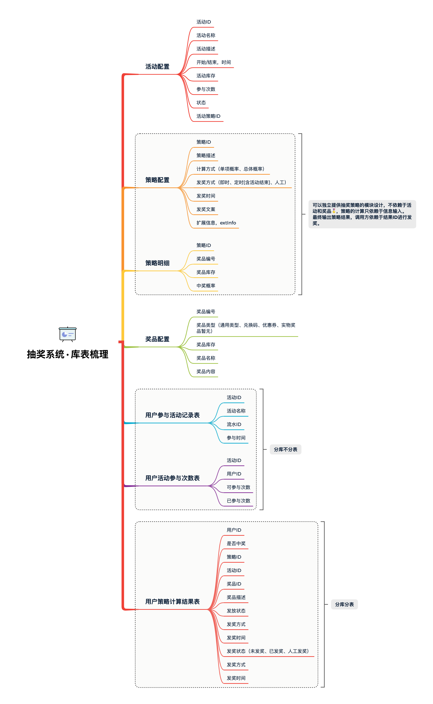
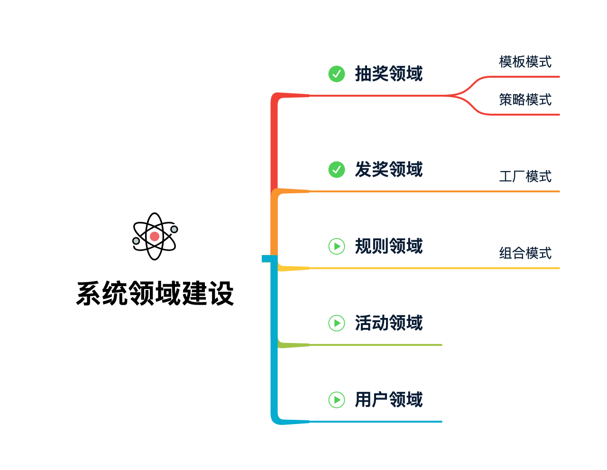
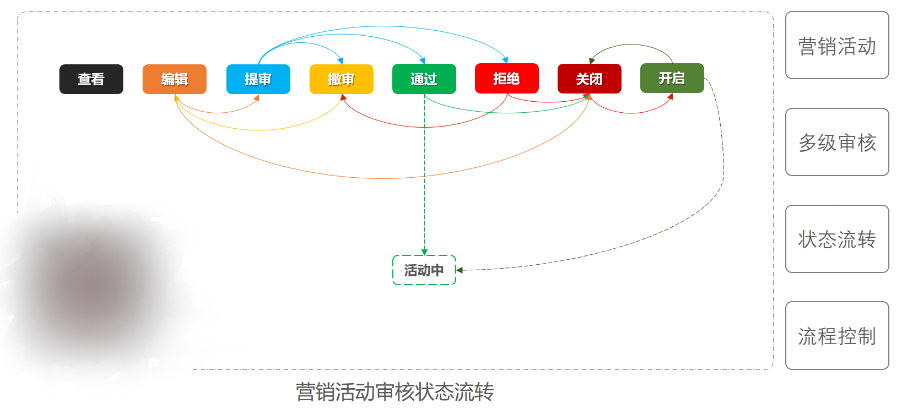
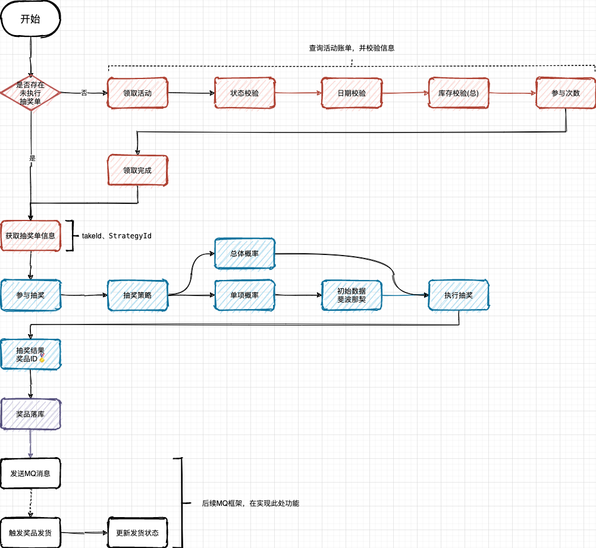

# Lottery营销平台

## 基础架构


### DDD分层架构
项目结构


#### 应用层Application

应用服务位于应用层。用来表述应用和用户行为，负责服务的组合、编排和转发，负责处理业务用例的执行顺序以及结果的拼装。
**应用层的服务包括应用服务和领域事件相关服务。**
**应用服务可对微服务内的领域服务以及微服务外的应用服务进行组合和编排，或者对基础层如文件、缓存等数据直接操作形成应用服务，对外提供粗粒度的服务。**
领域事件服务包括两类：领域事件的发布和订阅。通过事件总线和消息队列实现异步数据传输，实现微服务之间的解耦。

#### Domain层

领域服务位于领域层，为完成领域中跨实体或值对象的操作转换而封装的服务，领域服务以与实体和值对象相同的方式参与实施过程。
**领域服务对同一个实体的一个或多个方法进行组合和封装，或对多个不同实体的操作进行组合或编排，对外暴露成领域服务。领域服务封装了核心的业务逻辑。实体自身的行为在实体类内部实现，向上封装成领域服务暴露。**
**为隐藏领域层的业务逻辑实现，所有领域方法和服务等均须通过领域服务对外暴露。**
为实现微服务内聚合之间的解耦，原则上禁止跨聚合的领域服务调用和跨聚合的数据相互关联。

#### Infrastructure层

基础服务位于基础层。为各层提供资源服务（如数据库、缓存等），实现各层的解耦，降低外部资源变化对业务逻辑的影响。

基础服务主要为仓储服务，通过依赖反转的方式为各层提供基础资源服务，领域服务和应用服务调用仓储服务接口，利用仓储实现持久化数据对象或直接访问基础资源。

一般对应一些数据库的实体类都放到这里，还有一些dao的都放到这一层进行处理

#### Interface层

接口服务位于用户接口层，用于处理用户发送的**Restful**请求和解析用户输入的配置文件等，并将信息传递给应用层。

### RPC

对外提供接口描述信息

一般将接口都写在这里面，然后在interface中进行实现，然后在应用层application进行dubboReference进行rpc的调用。这样就完成了一部分的调用工作。

#### Dubbo的配置

一般都是配置zookeeper为注册中心

```yaml
dubbo:
  registry:
    address: zookeeper://ip:2181  #注册中心
  application:
    name: Lottery
    version: 1.0
  protocol:  #使用的协议，默认是使用dubbo进行的，是rpc，处于osi7层模型中的第五层。也可以rmi远程调用，或者http等方式进行调用
    name: dubbo
    port: 20881
  scan:
    base-packages: com.kevin.lottery.rpc  #接口扫描
```

`dubbo的调用过程`


### 活动表设计

因为是一个抽奖系统，首先涉及到活动

因此需要一个活动表

对应的字段应该有：主键id、活动名称、活动id(多张表联合，对应具体的活动细节)、活动开始时间、活动结束时间、活动描述、活动可以参加人数、库存、活动状态(1编辑、2提审、3撤审、4通过、5运行(审核通过后worker扫描状态)、6拒绝、7关闭、8开启)、创建时间、更新时间、创建人、更新人


对应的建表语句如下：

```sql
create table `activity`(
	id bigint(20) not null AUTO_INCREMENT comment '自增id',
	activity_id bigint(20) not null comment '活动id',
	activity_name varchar(64) CHARACTER set utf8mb4 DEFAULT null comment '活动名称',
	activity_desc varchar(128) CHARACTER set utf8mb4 DEFAULT null comment '活动描述',
	begin_date_time datetime DEFAULT null COMMENT '活动开始时间',
	end_date_time datetime DEFAULT null comment '活动结束时间',
	stock_count int(11) DEFAULT null comment '库存',
	take_count int(11) DEFAULT null comment '每次活动可以参加人数',
	state TINYINT(2) DEFAULT null comment '活动状态：1编辑、2提审、3撤审、4通过、5运行(审核通过后worker扫描状态)、6拒绝、7关闭、8开启',
	create_time datetime DEFAULT CURRENT_TIMESTAMP comment '创建时间',
	update_time datetime DEFAULT CURRENT_TIMESTAMP comment '更新时间',
	creator varchar(64) CHARACTER set utf8mb4 comment '创建人',
	PRIMARY KEY(`id`),
	unique key `unique_activity_id`(`activity_id`)
)ENGINE = INNODB auto_increment=2 DEFAULT charset=utf8mb4 collate=utf8mb4_bin comment ='活动配置';
```

这里的utf8mb4_bin 是一种区分大小写和二进制比较的utf-8编码字符集。

#### 对应的具体表


因为涉及到活动，活动的进行规则、策略，奖品的发放，以及奖品发放等信息，以及用户、用户参与信息等表。

#### 使用策略模式解决算法调用问题
这里有一个抽奖算法，一个是单例随机算法，另一个是全局随机算法
单例不用重新计算概率，全局需要重新计算对应的概率问题

所以这里使用一个枚举类执行对应的获取实现类，然后执行对应的概率方法，完成抽奖概率分配。
同时使用斐波那锲进行概率分布

#### 模板模式的使用
模板模式主要为了解决对一些通用方法的封装，以及对一些类进行对应的分工明确操作。
这里对一般常用的初始化方式进行了封装，设置成为config的默认方法，然后对于执行抽奖方法也进行了对应的默认实现。

但是对于一些模式排除，算法具体详情、结果排除等需要根据业务来执行的方法，进行对应的按照业务类进行实现。

## 设计模式的使用


### 状态模式解决流程问题
基础流程：

通过模板模式解决通用的流程方法，并且配合IStateHandler进行状态处理接口的方法
进行实现每一个状态对应的方法，其中对于每一个状态，都单独定义一个类出来进行对应的实现，包括继承了基础类，和实现了对应的刘恒处理方法。
并配合策略模式，将对应的类按照对应的枚举类型注入到一个map中，调用的时候需要找到对应的状态类型，然后执行他对应的状态方法就行了。
其中这些状态类的状态方法是根据自己处于 转台进行对应的调整的

#### 分布式id生成

这里使用了一个策略模式进行id的生成，根据对应的业务选择对应的id生成策略。

有雪花算法、短时间id+随机数生成，时间+ip生成等。

如下：

编写一个id生成接口

```java
public interface IIDGenerate {

    /**
     *获取ID，目前有两种实现方式 1. 雪花算法，用于生成单号
     * 2. 日期算法，用于生成活动编号类，特性是生成数字串较短，但指定时间内不能生成太多
     * 3. 随机算法，用于生成策略ID
     * @return 返回根据策略生成的id
     */
    Long nextId();
}
```

并进行对应的类别实现

雪花id

```java
@Component
public class SnowFlake implements IIDGenerate {
    private Snowflake snowFlake;

    @PostConstruct
    public void init(){
        long workId;

        try {
            workId = NetUtil.ipv4ToLong(NetUtil.getLocalhostStr());
        } catch (Exception e) {
            workId = NetUtil.getLocalhost().hashCode();
        }
        workId = workId >>16 &31;
        long dateCenterId = 1l;
        snowFlake = IdUtil.createSnowflake(workId,dateCenterId);
    }
    @Override
    public Long nextId(){
        return snowFlake.nextId();
    }
}
```

短id

```java
@Component
public class ShortCode implements IIDGenerate {

    @Override
    public Long nextId() {
        Calendar calendar = Calendar.getInstance();

        int year = calendar.get(Calendar.YEAR);
        int week = calendar.get(Calendar.WEEK_OF_YEAR);
        int day = calendar.get(Calendar.DAY_OF_MONTH);
        int hour = calendar.get(Calendar.HOUR_OF_DAY);

        StringBuilder sb = new StringBuilder();

        sb.append(year-2020).append(hour).append(String.format("%02d",week)).append(day).append(String.format("%03d",new Random().nextInt(1000)));

        return Long.parseLong(sb.toString());
    }
}

```

随机id

```java
@Component
public class RandomNumeric implements IIDGenerate {

    @Override
    public Long nextId() {
        return Long.parseLong(RandomStringUtils.randomNumeric(11));
    }
}
```

然后重新整合一个策略模式的总体组，将这些id生成类型的接口一一根据对应的类型放入进去，调用的时候传入对应的类型即可调用对应的id生成算法

```java
@Component
public class IDContext {

    /**
     * 创建 ID 生成策略对象，属于策略设计模式的使用方式
     * Params:
     * snowFlake – 雪花算法，长码，大量 shortCode – 日期算法，短码，少量，全局唯一需要自己保证 randomNumeric – 随机算法，短码，大量，全局唯一需要自己保证
     * Returns:
     * IIdGenerator 实现类
     * @param randomNumeric
     * @param shortCode
     * @param snowFlake
     * @return
     */
    @Bean
    public Map<Constance.Ids, IIDGenerate> idGenerateMap(RandomNumeric randomNumeric, ShortCode shortCode, SnowFlake snowFlake){
        Map<Constance.Ids,IIDGenerate> map = new HashMap<>(8);
        map.put(Constance.Ids.RandomNumeric,randomNumeric);
        map.put(Constance.Ids.ShortCode,shortCode);
        map.put(Constance.Ids.SnowFlake,snowFlake);
        return map;
    }
}
```
### 整个抽奖流程的逻辑

这里使用了一个MQ来处理解耦，同时进行异步处理，让他这个流程处理下来不会因为抽奖的某一个步骤卡主，整个接口就卡住
，对他进行异步处理，暂时解耦，先把接口返回回去，然后在对一些异步步骤使用消息来进行处理，这样既能够保证整个接口的响应速度和解耦


## 待解决的问题
1. mapper和对应的xml没有映射到的问题
   2. 这个你需要注意查看你使用的是mybatis还是mybatis-plus，如果你使用的是plus，应该是配置专属于plus的，而不是mybatis，否则他映射不到，具体看你使用的是plus的stater还是mybatis的stater
2. mybatis-plus写代码，多了以后，会不会变得混乱，是否直接使用mapper层进行执行对应的方法会更好呢？
